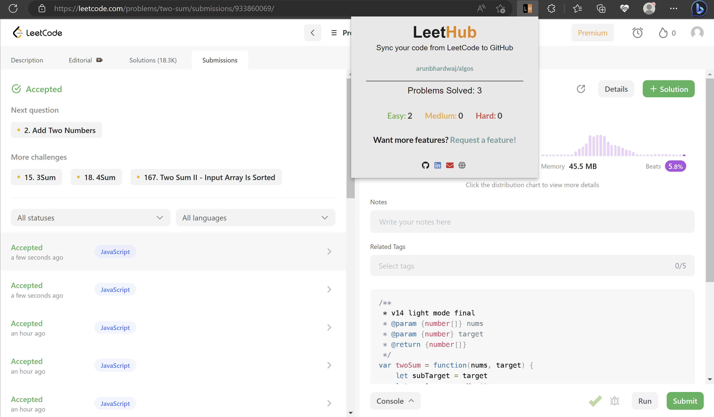

<div align="center">


# Code to Git

### Automatically sync your LeetCode solutions to GitHub — zero effort.

[](https://github.com/im-anishraj/code-to-git/blob/main/LICENSE)
[](https://chrome.google.com/webstore/detail/code-to-git/geodebjjkeochpcpjdkclmjbpkjblhnd)
[](https://github.com/im-anishraj/code-to-git/stargazers)
[](https://github.com/im-anishraj/code-to-git/pulls)

<br />



</div>

---

## ⚡ What is Code to Git?

**Code to Git** is a browser extension that **automatically pushes your accepted LeetCode solutions** to a GitHub repository the moment you pass all tests. No copy-pasting, no manual commits — just solve and go.

> 💡 Build your GitHub portfolio while you grind LeetCode. Recruiters love green squares.

---

## ✨ Features

| Feature | Description |
|---------|-------------|
| 🚀 **Auto-Sync** | Solutions are pushed to GitHub instantly when accepted on LeetCode |
| 📊 **Stats Dashboard** | Track your Easy, Medium, and Hard progress in a sleek popup |
| 🔒 **Secure OAuth** | Industry-standard OAuth2 authentication with GitHub |
| 📂 **Organized Repos** | Code is neatly organized into folders by problem name |
| 🌙 **Premium Dark UI** | Beautiful glassmorphism design inspired by Apple aesthetics |
| 🔗 **Flexible Setup** | Create a new repo or link an existing one — your choice |

---

## 🎯 Why Code to Git?

<table>
<tr>
<td width="50%">

### 📈 Build Your Portfolio
Recruiters **want** to see your GitHub activity. Every LeetCode solve becomes a real commit on your profile — automatically. Your GitHub becomes a living resume of your problem-solving skills.

</td>
<td width="50%">

### ⏱️ Save Time
Manually pushing code from LeetCode is painful and time-consuming. Code to Git eliminates that friction entirely. **Solve → Accept → Done.** Your code is already on GitHub.

</td>
</tr>
</table>

---

## 🚀 Getting Started

Getting up and running takes **under 60 seconds**:

```
1️⃣  Install the extension from Chrome Web Store
2️⃣  Click the extension icon → "Authorize with GitHub"
3️⃣  Create a new repo or link an existing one
4️⃣  Start solving on LeetCode — solutions sync automatically!
```

<div align="center">

</div>

---

## 🛠️ Tech Stack

| Technology | Purpose |
|------------|---------|
| **JavaScript (ES6+)** | Core extension logic |
| **Webpack** | Module bundling & build pipeline |
| **Chrome Extensions API (Manifest V3)** | Browser integration |
| **GitHub REST API** | Repository management & code pushing |
| **OAuth 2.0** | Secure authentication |
| **Custom CSS** | Premium dark UI with glassmorphism effects |

---

## 💻 Local Development

Want to contribute or tinker? Here's how to get set up:

```bash
# 1. Fork & clone
git clone https://github.com/<your-username>/code-to-git.git
cd code-to-git

# 2. Install dependencies
npm install

# 3. Build the extension
npm run build

# 4. Load in Chrome
#    → Navigate to chrome://extensions
#    → Enable "Developer mode" (top right toggle)
#    → Click "Load unpacked"
#    → Select the ./dist/chrome folder
```

### Available Scripts

| Command | Description |
|---------|-------------|
| `npm run build` | Build production extension to `./dist/` |
| `npm run dev` | Build & watch for changes |
| `npm run format` | Auto-format JS, HTML, CSS with Prettier |
| `npm run lint` | Lint JavaScript with ESLint |
| `npm run test` | Run test suite with Jasmine |

---

## 🤝 Contributing

Contributions are what make open source amazing! Any contributions you make are **greatly appreciated**.

1. **Fork** the repository
2. **Create** your feature branch (`git checkout -b feature/amazing-feature`)
3. **Commit** your changes (`git commit -m 'Add amazing feature'`)
4. **Push** to the branch (`git push origin feature/amazing-feature`)
5. **Open** a Pull Request

Check out [CONTRIBUTING.md](CONTRIBUTING.md) for detailed guidelines.

> ⭐ **If you find this useful, please consider giving it a star!** It helps others discover the project.

---

## 📋 Roadmap

- [x] Auto-sync accepted LeetCode solutions
- [x] Premium dark theme dashboard
- [x] Stats tracking (Easy / Medium / Hard)
- [ ] Support for multiple languages per problem
- [ ] Streak tracking & badges
- [ ] GeeksforGeeks integration
- [ ] Firefox Add-on store listing

Have an idea? [Request a feature →](https://github.com/im-anishraj/code-to-git/issues/new?labels=enhancement)

---

## 📄 License

Distributed under the **MIT License**. See [`LICENSE`](LICENSE) for more information.

---

## 🔒 Privacy

Your privacy matters. Code to Git does **not** collect, store, or transmit any personal data to external servers. All data stays in your browser. Read the full [Privacy Policy](PRIVACY.md).

---

<div align="center">

**Made with ❤️ by [Anish Raj](https://github.com/im-anishraj)**

<br />

[](https://github.com/im-anishraj)

</div>
